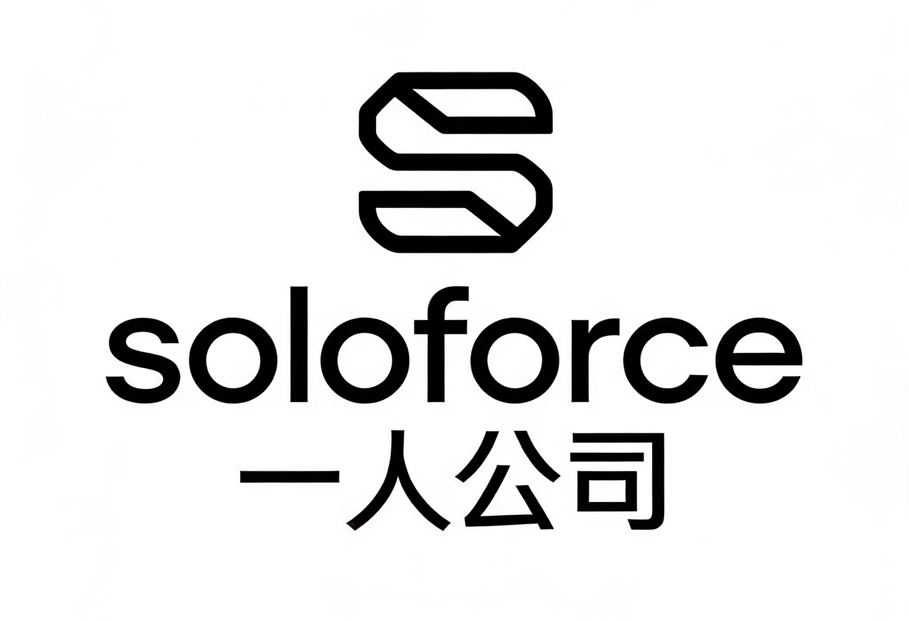
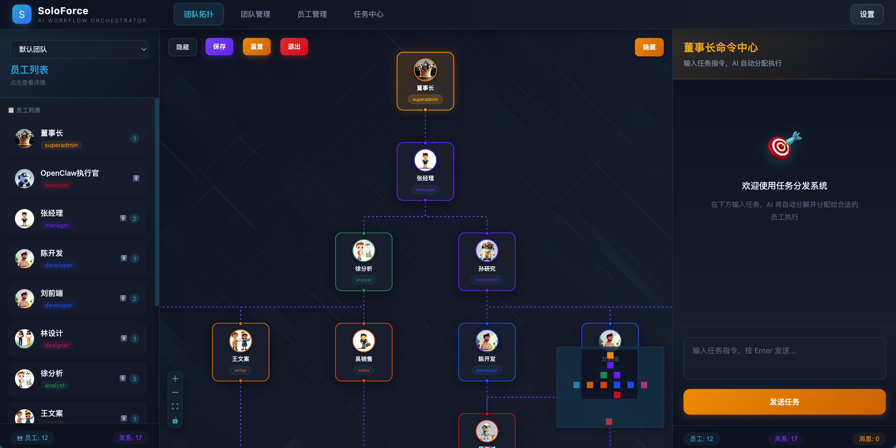
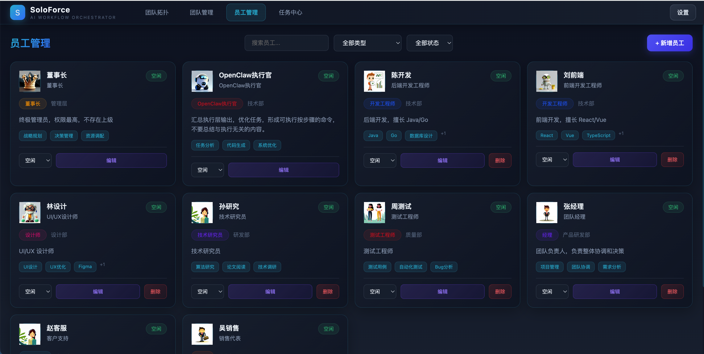
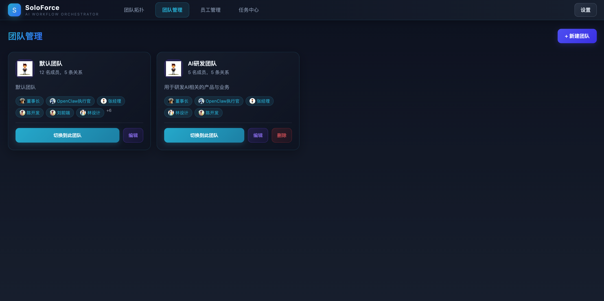
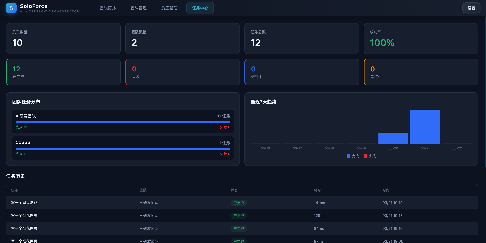
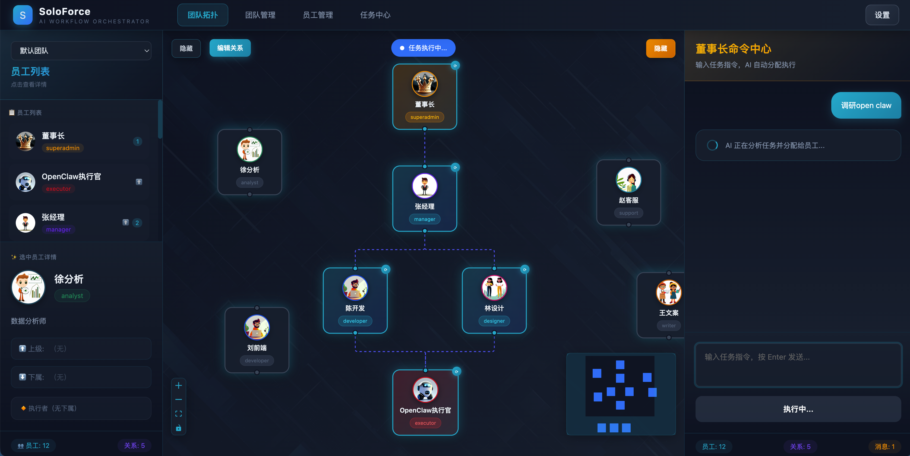
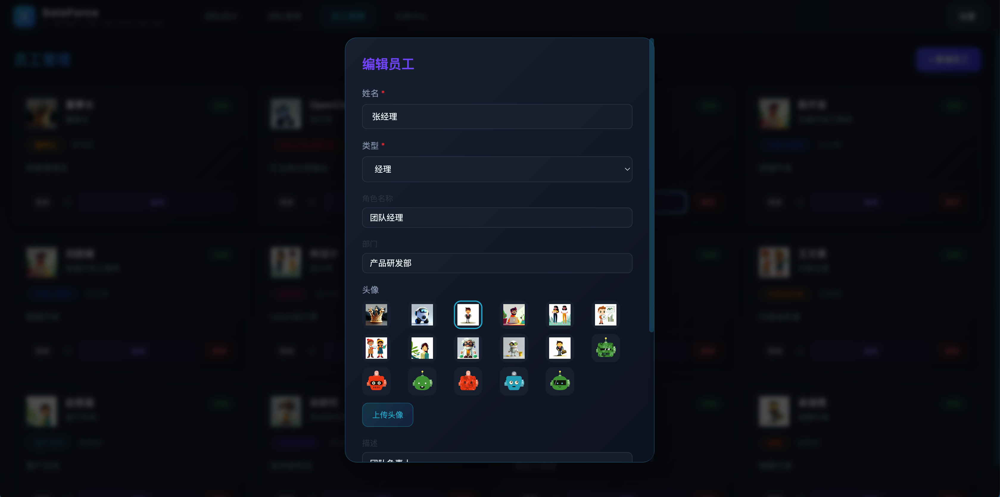
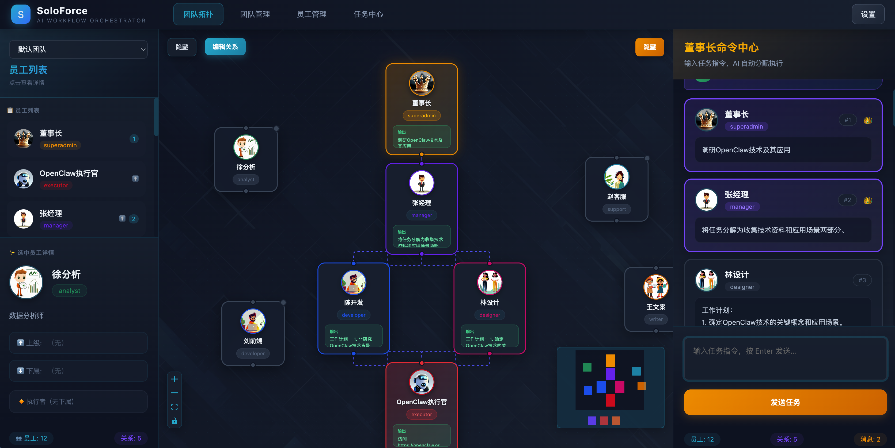
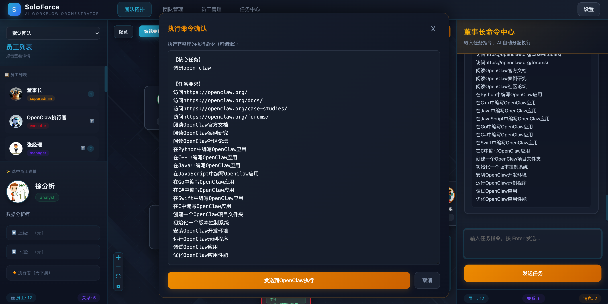
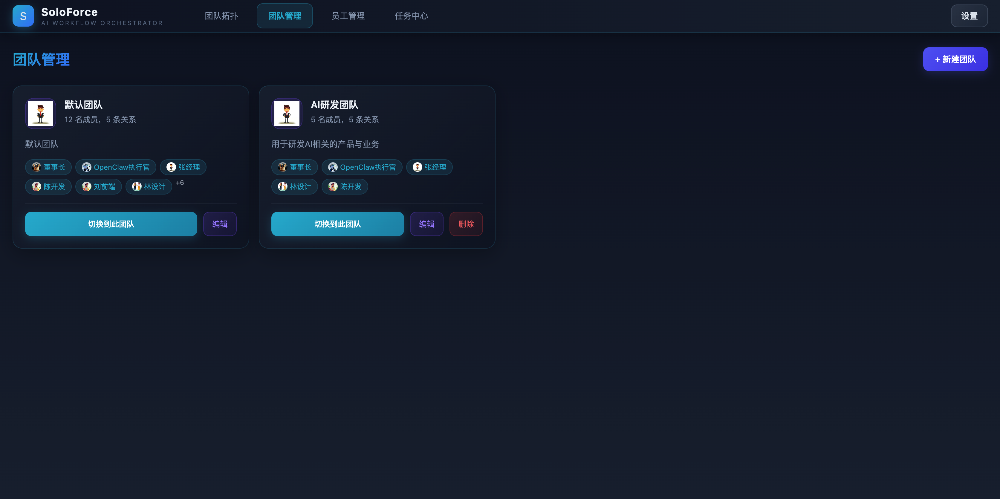

# SoloForce

> 🌐 **Language / 语言**: [English](./README.md) | [中文](./README-zh.md)

<p align="center">
  
</p>

<p align="center">
  <a href="https://github.com/yourusername/SoloForce">
    
  </a>
  <a href="https://github.com/yourusername/SoloForce/blob/main/LICENSE">
    
  </a>
  <a href="https://github.com/yourusername/SoloForce">
    
  </a>
  <a href="https://github.com/yourusername/SoloForce">
    
  </a>
  <a href="https://github.com/yourusername/SoloForce">
    
  </a>
</p>

<p align="center">
  <a href="https://github.com/yourusername/SoloForce">
    
  </a>
  <a href="https://github.com/yourusername/SoloForce/fork">
    
  </a>
</p>

---

## 📋 Table of Contents

- [Introduction](#-introduction)
- [Preview](#-preview)
- [Features](#-features)
- [Tech Stack](#-tech-stack)
- [Getting Started](#-getting-started)
- [Project Structure](#-project-structure)
- [Configuration](#-configuration)
- [Usage Guide](#-usage-guide)
- [Roadmap](#-roadmap)
- [License](#-license)

---

## 📖 Introduction

**SoloForce** is an AI-powered intelligent workflow orchestration system.

In the digital economy era, how can individuals or small teams efficiently manage multiple AI assistants to complete complex tasks? SoloForce provides the answer—achieving the dream of **managing a "digital team" with one person** through AI technology.

### 🌟 Core Vision

> **The future of enterprises will no longer rely on traditional "human resources" but shift to "digital human resources"**
> 
> One human CEO + N AI digital employees = One highly efficient "one-person company"

SoloForce is the practitioner of this vision—enabling everyone to become the true leader of a "one-person company".

---

## 📸 Preview

<p align="center">

| | |
|:---:|:---:|
|  |  |
| **Team Topology** | **Employee Management** |
|  |  |
| **Team Management** | **Task Center** |

</p>

---

## ✨ Features

### 1️⃣ Team Topology Visualization



Graphically display "digital employee" organization and reporting relationships, support drag-and-drop to establish management workflows.

---

### 2️⃣ Custom Digital Employees



Create and manage exclusive digital employees, define roles, skills, and responsibilities to build your virtual team.

---

### 3️⃣ AI-Powered Task Distribution



After inputting a task, AI automatically analyzes and distributes it to suitable "digital employees", simulating real company task allocation processes.

---

### 4️⃣ OpenClaw Execution Integration



After task completion, extract executable technical commands and send them to OpenClaw for execution with one click.

---

### 5️⃣ Multi-Team Management



Support creating multiple virtual teams, each with independent employee configuration and topology relationships.

---

## 🛠️ Tech Stack

| Category | Technology |
|----------|------------|
| Frontend | React 18 + TypeScript + Vite |
| Visualization | React Flow |
| Backend | Express + Node.js |
| AI Engine | OpenAI Compatible API |
| Styling | CSS-in-JS (Deep Sea Tech Style) |

---

## 🚀 Getting Started

### Installation

```bash
# Clone the repository
git clone https://github.com/yourusername/SoloForce.git
cd SoloForce

# Install dependencies
npm install
```

### Configuration

```bash
# Copy the config template
cp .env.example .env

# Edit .env file to configure your API Key
```

### Start

```bash
# Terminal 1: Start backend server
npm run server

# Terminal 2: Start frontend server
npm run dev
```

Visit http://localhost:5300

### Build

```bash
npm run build
```

---

## 📁 Project Structure

```
SoloForce/
├── public/                 # Static assets
│   └── avatars/           # Digital employee avatars
├── src/                   # Frontend source code
│   ├── components/        # React components
│   ├── pages/             # Page components
│   ├── store.ts           # State management
│   ├── types.ts           # Type definitions
│   └── App.tsx            # Main application
├── server.ts              # Express backend service
├── package.json           # Project configuration
└── vite.config.ts         # Vite configuration
```

---

## 🔧 Configuration

### Environment Variables

Create a `.env` file in the project root:

```env
# Backend server port
PORT=5301

# LLM API (Required)
# Supports OpenAI compatible APIs (GPT, Claude, Qwen, DeepSeek, etc.)
OPENAI_BASE_URL=https://api.siliconflow.cn/v1
OPENAI_MODEL=qwen2.5-7b-instruct
OPENAI_API_KEY=your_api_key_here

# OpenClaw Configuration (Optional)
OPENCLAW_URL=http://127.0.0.1:18789
OPENCLAW_TOKEN=your_token
OPENCLAW_AGENT_ID=main
```

### Port Reference

| Service | Port | Description |
|---------|------|-------------|
| Frontend | 5300 | Vite dev server |
| Backend | 5301 | Express API service |

---

## 📖 Usage Guide

| Step | Action | Description |
|:---:|--------|-------------|
| 1️⃣ | Create Team | Create virtual teams in "Team Management", configure members |
| 2️⃣ | Build Topology | Drag to connect "digital employee" nodes, establish relationships |
| 3️⃣ | Submit Task | Input tasks in "Chairman Command Center", AI auto-distributes |
| 4️⃣ | Execute | After task completion, edit and confirm to send to OpenClaw |

---

## 🔮 Roadmap

### v2.0 - Multimodal Interaction
- [ ] Support voice input for tasks
- [ ] Add voice broadcast for execution results
- [ ] Support image/file upload

### v2.1 - Intelligent Evolution
- [ ] AI employee self-learning optimization
- [ ] Intelligent analysis of task execution history
- [ ] Auto-suggest optimal workflows

### v2.2 - Ecosystem Expansion
- [ ] Support more AI platform integrations
- [ ] Plugin marketplace - share workflow templates
- [ ] API - third-party integrations

### v3.0 - Digital Labor Market
- [ ] Digital employee marketplace
- [ ] Team collaboration
- [ ] Enterprise deployment

---

## 🤝 Partnership

SoloForce is seeking like-minded partners to explore the infinite possibilities of the "one-person company":

### 🔍 We're Looking For

| Direction | Description |
|-----------|-------------|
| 🌐 **Tech Partners** | AI Agent platforms, cloud services, developer tools |
| 📢 **Promotion Channels** | Tech bloggers, community influencers, content creators |
| 💡 **Product Advisors** | Product design, UX, commercialization strategy |
| 💰 **Investment** | Angel/seed funding (for team expansion and product iteration) |

### 💼 Collaboration Forms

- **Technical Integration** - Integrate SoloForce capabilities into your products
- **Joint Operations** - Build "one-person company" ecosystem together
- **Custom Development** - Provide private deployment services for enterprise clients
- **Content Co-creation** - Tutorials, case studies, best practices

### 📞 Contact Us

- 📧 Email: 1781824487@qq.com
- 💬 GitHub Issues: Feel free to ask questions and make suggestions
- 🌐 Website: https://soloforce.ai (coming soon)

---

## 📄 License

This project is open source under the MIT License. See [LICENSE](LICENSE) for details.

---

<p align="center">
  <strong>SoloForce - One Person, One Company</strong>
</p>

<p align="center">
  ⭐ If you find this project helpful, please star to show your support!
</p>
